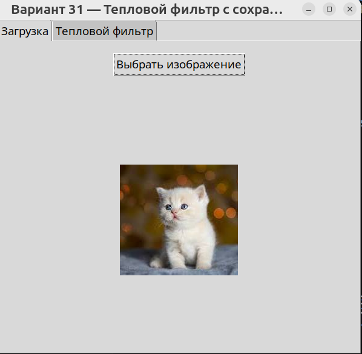
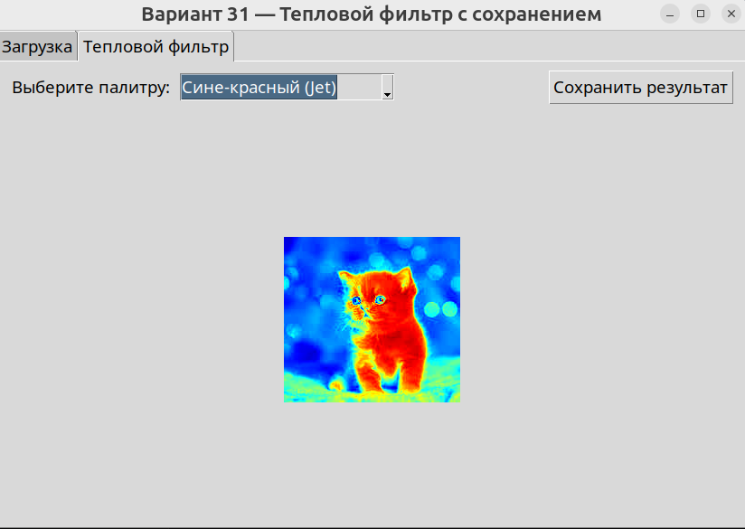

# BlendApp — приложение для смешивания двух изображений

Приложение позволяет загружать два изображения, автоматически выравнивать их по размеру,
создавать плавный градиентный переход между ними и сохранять итоговый результат.

## 📌 Возможности
- Загрузка двух изображений
- Автоматическое изменение размера второго изображения под первое
- Плавное смешивание изображений с помощью горизонтальной маски
- Регулировка центра градиента (ползунок)
- Предпросмотр результата в реальном времени
- Сохранение итогового изображения в PNG / JPEG / BMP

## 📁 Структура проекта
BlendApp.py           — основной GUI (интерфейс)
ImageProcessor.py     — логика смешивания изображений
requirements.txt      — зависимости
.gitignore            — игнорируемые файлы
README.md             — описание проекта

## 🚀 Установка и запуск

### 1. Создать виртуальное окружение
python -m venv .venv
source .venv/bin/activate   # Linux / macOS
.venv\Scripts\activate      # Windows

### 2. Установить зависимости
pip install -r requirements.txt

### 3. Запуск приложения
python BlendApp.py

## Скриншоты

Ниже приведены примеры работы приложения.

### Вкладка «Контроль»

### Вкладка «Результат»

